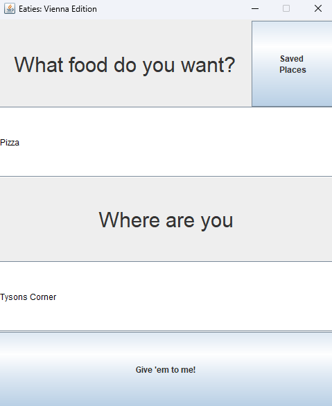

# Food-App
## Description 
The main purpose of this project is to allow users to find restaurants that are near them depending on what food they want. This project uses Java Swing and GSON to parse json data gathered from the Google Maps Places API.

## Demonstration
### 1. When you first run the application you will be taken to the following screen.

### 2. You can enter the food you want and where you are then click on the button at the bottom.

