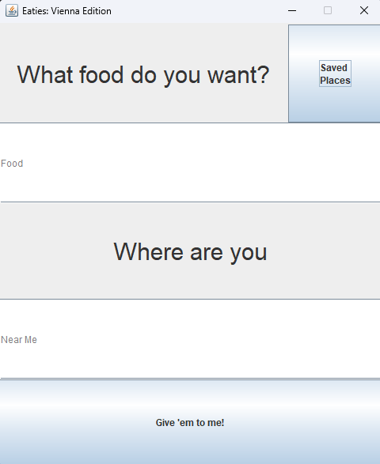

# Food-App
## Description 
The main purpose of this project is to allow users to find restaurants that are near them depending on what food they want. This project uses Java Swing and GSON to parse json data gathered from the Google Maps Places API.

## Demonstration

