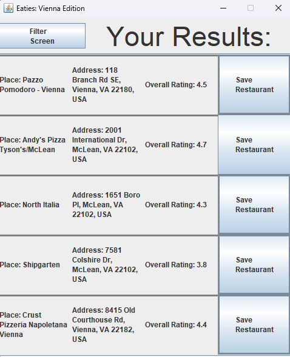

# Food-App
## Description 
The main purpose of this project is to allow users to find restaurants that are near them depending on what food they want. This project uses Java Swing and GSON to parse json data gathered from the Google Maps Places API.

## Demonstration
### 1. When you first run the application you will be taken to the following screen.

### 2. You can enter the food you want and where you are then click on the button at the bottom.

### 3. After clicking the button at the bottom it will take you to a screen that has restaurants close to the area you entered which serves the food you entered.

### 4. Once you have the list of restaurants, you can save the ones that sound interesting or have the best rating.

### 5. After saving some restaurants, you can click on the filter screen button at the top left to take you back to the initial screen.

### 6. Once back on the initial screen you can either make another search or look at your saved restaurants. To look at your saved restaurants click the button at the top right of the screen.

### 7. You can remove any of your saved restaurants by clicking on the remove button to the right.

          
